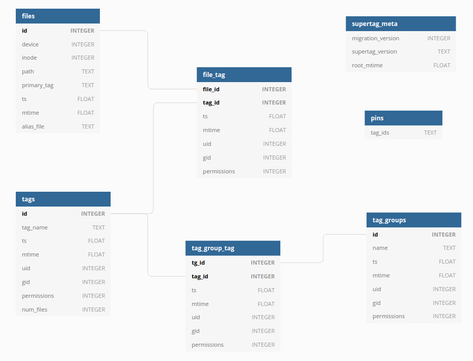

.. _database_schema:

Database Schema
###############

The database is pretty simple. There are no real surprises, just some small tables with simple
relationships.

.. https://dbdiagram.io/d/5f229e7e7543d301bf5d4a13

.. _files_table:

files
*****

The ``files`` table contains files names that exist inside an entire :term:`collection`. A file record is inserted
when a new file is :ref:`linked <linking>` into Supertag.

device
    The device id where the target file resides. Together with the inode column, this can be used to reliably point to
    any file.

inode
    The inode number of the target file. Together with the device column, this can be used to reliably point to
    any file.

path
    The full path to the target file. This is used when resolving the Supertag symlink to the file. Due to this being
    a fragile field, if the target file moves, this breaks and needs healing, which is not yet implemented on Linux.

primary_tag
    The file's name as it appears in Supertag. Typically this will be populated with the name of the original file,
    when it was imported or linked.

ts
    The timestamp of when the record was created.

mtime
    The modification time of the file record.

alias_file
    This column is only used on MacOS. See :ref:`MacOS Aliases <macos_aliases>` for an explanation.

.. _tags_table:

tags
****

The ``tags`` table represents all of the :term:`tags <tag>` in the :term:`collection`. Every tag will have a
corresponding folder at the top level of the :term:`manifolder`. A tag record is inserted when a tag is
:ref:`created <creating_tags>`.

tag_name
    The tag name. Surprise!

ts
    The timestamp of when the record was created.

mtime
    The modification time of the tag record.

uid
    The user id that the tag directory should have.

gid
    The group id that the tag directory should have.

permissions
    The permissions of the tag's directory.

num_files
    A pre-computed cache of the number of files that have this tag.

file_tag
********

The many-to-many intermediate table for :ref:`files <files_table>` and :ref:`tags <tags_table>`. A file can be tagged
with many tags, and a tag can apply to many files. A file_tag record is inserted when a file is :ref:`linked <linking_files>`
to a tag.

ts
    The timestamp of when the record was created.

mtime
    The modification time of the file-tag record.

uid
    The user id that the file should have, in the tag directory it is linked to.

gid
    The group id that the file should have, in the tag directory it is linked to.

permissions
    The permissions of the tag's directory, derived from the umask of the user who created it.

tag_groups
**********

The ``tag_groups`` table stores :ref:`tag groups`.

name
    The tag group name. Surprise!

ts
    The timestamp of when the record was created.

mtime
    The modification time of the tag group record.

uid
    The user id that the tag group directory should have.

gid
    The group id that the tag group directory should have.

permissions
    The permissions of the tag group's directory.

tag_group_tag
**************

The many-to-many intermediate table for :ref:`tags <tags_table>` and :ref:`tag_groups <tag_groups_table>`. A tag can
belong to many tag groups, and a tag group can contain many tags. A record for this table is inserted when the user
:ref:`creates a tag group <creating_taggroups>`.

ts
    The timestamp of when the record was created.

mtime
    The modification time of the tag-group-tag record.

uid
    The user id that the tag-group-tag directory should have.

gid
    The group id that the tag-group-tag directory should have.

permissions
    The permissions of the tag-group-tag's directory.

supertag_meta
*************

This metadata table tracks some simple data related to the Supertag collection itself.

migration_version
    A simple integer version of which db migrations have been applied.

supertag_version
    The semantic version of the app.

root_mtime
    The modification time of the root collection directory itself.

pins
****

Pins are essentially tag intersections that have been "pinned" to exist. They originate from the need
to create tag folders before tagging files into them. For example, pins allow you to create ``/tag1/tag2/``
and then link a file into that subdirectory. You normally wouldn't be able to do this, as without pins,
``tag2`` would only appear under ``tag1`` if they contain intersecting files.

tag_ids
    Each row is a path containing the tag ids to pin.
