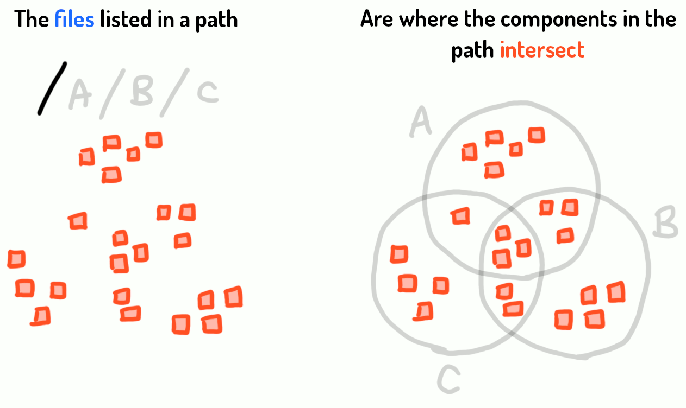

.. Supertag documentation master file, created by
   sphinx-quickstart on Sun Jul 26 02:18:54 2020.
   You can adapt this file completely to your liking, but it should at least
   contain the root `toctree` directive.

.. toctree::
   :maxdepth: 2
   :hidden:

   installation
   usage
   config
   architecture
   development
   os_behavior
   database_schema

   tips_and_tricks
   glossary
   faq

Supertag
########

.. raw:: html

    

        <video style="width: 65%" loop autoPlay muted>
            <source src="https://s3-us-west-2.amazonaws.com/supertag.ai/docs_logo.mp4" type="video/mp4" />
        </video>
    

.. image:: https://img.shields.io/travis/amoffat/supertag/master.svg?style=flat-square
    :target: https://travis-ci.org/amoffat/supertag
    :alt: Build Status
.. image:: https://img.shields.io/coveralls/amoffat/supertag.svg?style=flat-square
    :target: https://coveralls.io/r/amoffat/supertag?branch=master
    :alt: Coverage Status

Supertag is a tag-based file system, written in `Rust <https://www.rust-lang.org/>`_,
that provides a unique view of your files by removing the
hierarchy constraints typically imposed on files and folders.

Below, the file path ``/A/B/C`` yields the :term:`intersection` of all of the files that have been tagged with the
tags ``A``, ``B``, and ``C``. Notice that the resulting files do not live *inside* of the full path,
they simply appear there because they've been tagged with each part of the file path.
Supertag takes care of rendering a dynamic directory
structure through which you can filter and navigate these files.

.. note::
   You ``/A/B/C`` yields the same file intersection as ``/C/B/A``, ``/B/C/A``, etc. It doesn't matter what
   order that the path tags are in, because we're simply dealing with the intersection of the tags.

Cool, right? See :ref:`Quickstart` for the crash course.