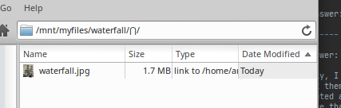
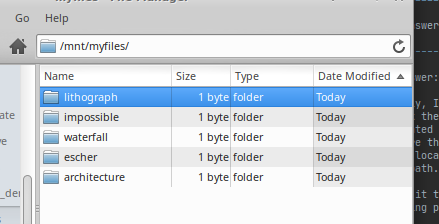
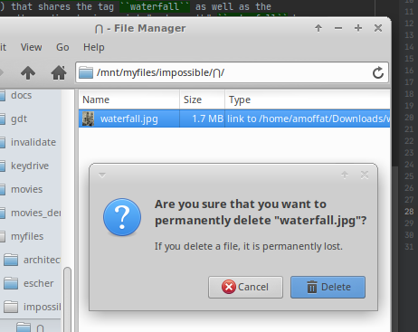

.. _quickstart:

Quickstart
###########

.. note::
    This quickstart was performed on Linux, but most instructions should be relatively similar in MacOS, besides a
    few of the file browser GUI instructions, which you will need to adapt to Finder.

After you've :ref:`installed <installation>` Supertag, you are ready to start using it. First, let's mount a new
:term:`collection`:

.. code-block:: bash

    tag mount myfiles

You may see an error on Linux, which requires the directory in ``/mnt`` to exist first:

.. error::

    | Mounting to "/mnt/myfiles"
    | Error: Mount directory "/mnt/myfiles" missing. Please create it first before mounting.

Make this directory yourself, change it to be owned by your user, and run the ``mount`` subcommand again. You should see something like:

.. code-block::

    Mounting to "/mnt/myfiles"
    Forked into background PID 19754

Great, Supertag tells where it mounted your collection and opens that location in a file browser. We can check what collections are available and where they're mounted with:

.. code-block:: bash

    tag fstab

Output:

.. code-block::

    Collections:
      * myfiles => /mnt/myfiles

The star in front indicates a :term:`primary collection`, and because the collection is mounted, we see the path that
it is mounted to.

Now let's start tagging files. First, save this photo of M. C. Escher's *Waterfall.* We'll
use it to test out tagging:

Now let's tag it using our tag binary:

.. code-block:: bash

    tag ln waterfall.jpg escher/waterfall/architecture

Now let's browse to ``/mnt/myfiles`` and explore what Supertag did. Supertag created 3 new tags---representing
them as directories---and then linked ``waterfall.jpg`` into each of those directories:

.. image:: ../images/quickstart/3tags.png

Click into ``waterfall``. You'll see the following directories listed:

.. image:: ../images/quickstart/subdirs.png

What's happening here is Supertag is showing ``escher`` and ``architecture`` as subdirectories
because there exists at least 1 file (waterfall.jpg) that shares the tag ``waterfall`` as well as the
tags ``escher`` and ``architecture``. In other words, these directories exist "underneath" ``waterfall`` because
they share files *with* ``waterfall``.

You'll also notice a funny directory named ``⋂``. This directory means "the intersection of" (in fact, it is the
math symbol for that concept). Its
contents will be the *files* of the intersection of the tags in your current path:

Let's add a couple more tags, but this time, let's use some of our native system binaries. First
let's create some :term:`tagdirs <tagdir>` to ensure that we have somewhere to link to:

.. code-block:: bash

    mkdir -p /mnt/myfiles/lithograph/impossible

Now let's link our photo with a symlink:

.. code-block:: bash

    ln -sf waterfall.jpg /mnt/myfiles/lithograph/impossible

This added 2 more tags to our photo:

.. note::

    We could have created our tags separately with individual mkdir commands, and also linked
    the photo to those two tags with individual ln commands, but I wanted to demonstrate the
    concept of :term:`pinning`, as well as applying multiple tags at once.

Now let us remove a file from a single tag. To do this, first browse from the *top-level* of your collection and
open the tagpath ``impossible/⋂/``. Inside you will see ``waterfall.jpg``. Delete it using your file browser's
"permanent delete" feature, which is sometimes the shift + delete key:

As expected, the file is untagged from ``impossible`` because that is where you deleted the file from.

.. note::
    Following this logic, you may think that you can also untag a file from *multiple* tags at once, in the same way you can tag a file with multiple tags at once, but this is not the case---with deletions, Supertag will only remove the *last* tag in the tagpath from the file, and it will preserve the other tags.

Now that we're done, let's go ahead and unmount our collection. Predictably, this is accomplished with the unmount
subcommand:

.. code-block:: bash

    tag unmount myfiles

That's it for the quickstart! You now know how to mount, unmount, tag and untag. For more advanced usages, see the
remaining sections.